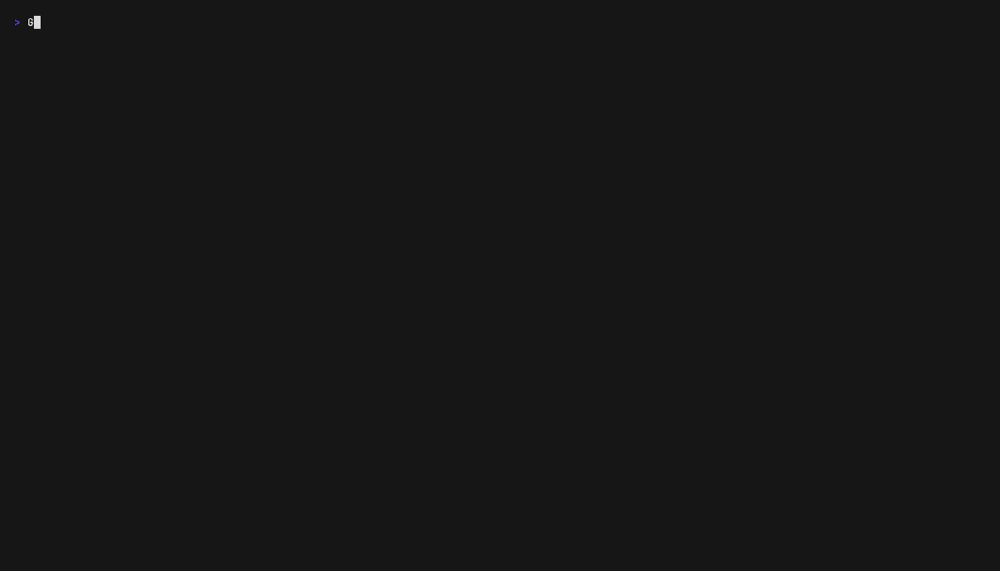
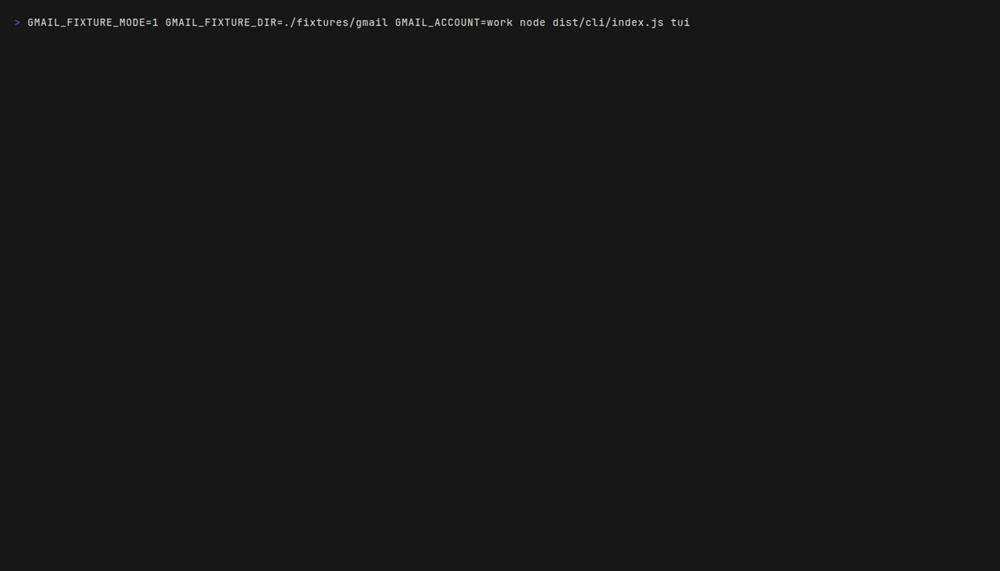
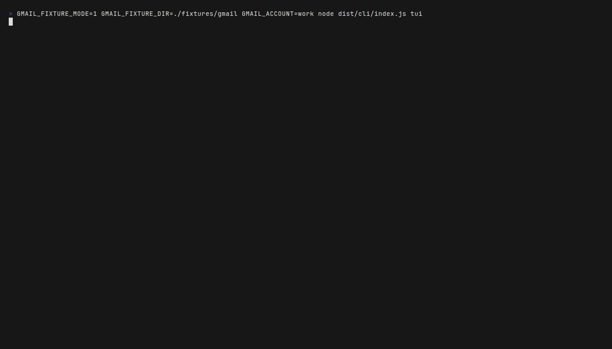
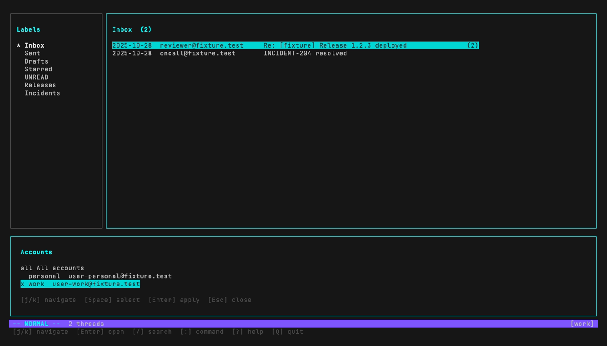
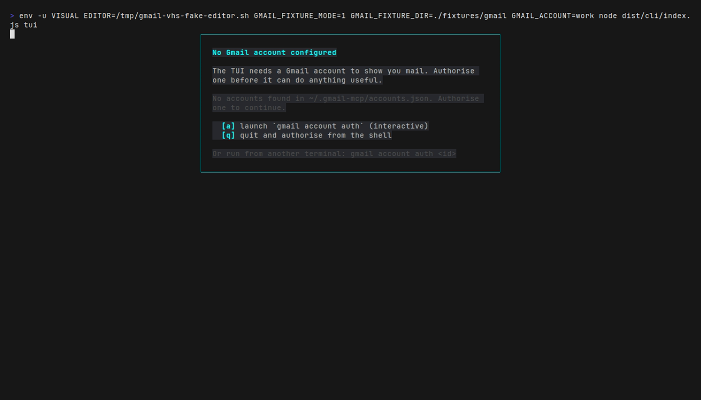
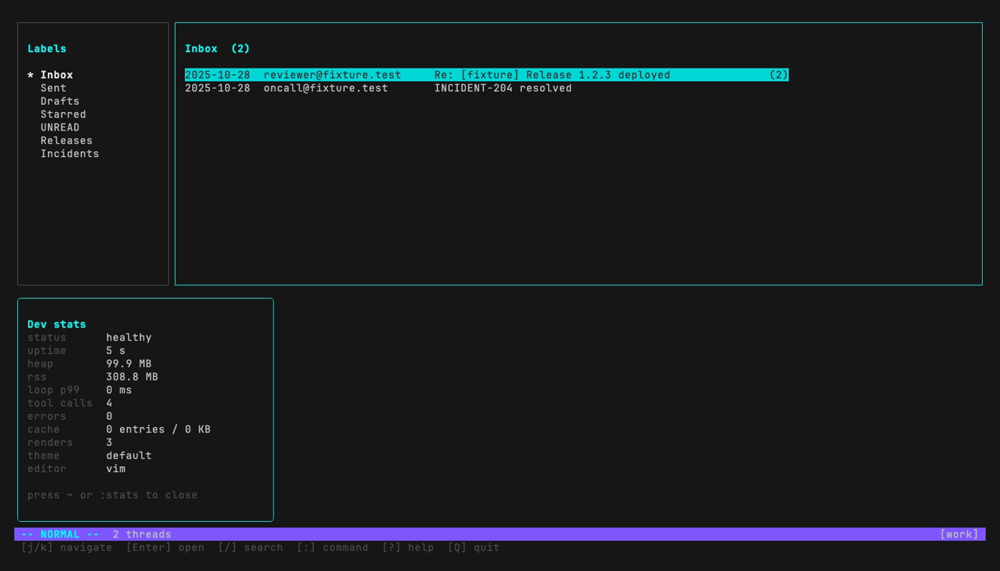

# `gmail tui` — screenshots

VHS-driven captures of the terminal UI, regenerated from the committed
fixture corpus. Every image here was produced by running
[`pnpm screenshots`](../scripts/screenshots/README.md) against
`GMAIL_FIXTURE_MODE=1` — no real Gmail data ever touches a tape.

To regenerate locally:

```sh
brew install vhs ttyd ffmpeg
brew install --cask font-jetbrains-mono
pnpm screenshots
```

The CI workflow under `.github/workflows/screenshots.yml` performs the
same regeneration on every push and refuses PRs that drift the captures.

---

## Workflow demo (animated)



A short story arc: the TUI boots into the work-account inbox, opens the
release thread, closes back to the inbox, opens the account switcher,
toggles the dev-stats overlay, and exits cleanly.

Tape: [`scripts/screenshots/workflow-demo.tape`](../scripts/screenshots/workflow-demo.tape)

---

## Boot — fixture-mode inbox



Cold boot against `fixtures/gmail/work/`. Sidebar lists the work-account
labels (Inbox / Sent / Drafts / Starred / UNREAD / Releases / Incidents).
Thread list shows the two seeded threads (Release 1.2.3 + INCIDENT-204)
with cursor on the first. Status bar shows the `[work]` account chip.

Tape: [`scripts/screenshots/01-boot-inbox.tape`](../scripts/screenshots/01-boot-inbox.tape)

---

## Open thread — MessagePane render



Pressing `Enter` opens the highlighted thread. Both messages render with
subject + from + `[work <user-work@fixture.test>]` account annotation +
date + body. The footer hint bar updates to the message-pane context
(`[r] reply`, `[R] reply-all`, `[q] back`).

Tape: [`scripts/screenshots/02-open-thread.tape`](../scripts/screenshots/02-open-thread.tape)

---

## Theme picker — `:theme`


`:theme` (no argument) opens the live picker. Eight themes ship:
`default`, `mono`, `dracula`, `solarized-dark`, `solarized-light`, `nord`,
`gruvbox`, and `nerd` (labelled "(requires Nerd Font)"). `j` / `k`
navigate, `Enter` applies live without re-mounting the tree, `Esc`
closes. `:theme dracula` (with an arg) switches immediately.

Tape: [`scripts/screenshots/03-theme-picker.tape`](../scripts/screenshots/03-theme-picker.tape)

---

## Account switcher — `:account`



`:account` opens the multi-account modal. The `all` row at the top opts
into the cross-account browse scope (sidebar empties, threads come from
every account); per-account rows show the `id` plus the synthetic
`@fixture.test` email. `x` next to `work` marks the currently-selected
account. `Enter` swaps via `switch_account`; the TUI subscribes to
`sessionEvents.accountChanged` and refreshes labels + inbox + the
account chip in a single tick.

Tape: [`scripts/screenshots/04-account-switcher.tape`](../scripts/screenshots/04-account-switcher.tape)

---

## Compose flow — `c`



`c` triggers `useEditor`: Ink releases raw mode, `spawn(EDITOR,
[tmp.eml], { stdio: "inherit" })` takes the TTY, the editor's exit
returns control to Ink. Here a fake editor (materialised at
`/tmp/gmail-vhs-fake-editor.sh` by the screenshots script) writes a
templated `To:` / `Subject:` / body, exits 0; `useEditor` parses the
result, dispatches `send_email`, the fixture client returns canned
success, and the status bar flips to `Email sent`.

In production the editor is real `$VISUAL` / `$EDITOR` / `vi`.

Tape: [`scripts/screenshots/05-compose-flow.tape`](../scripts/screenshots/05-compose-flow.tape)

---

## Dev stats — `:stats`



`:stats` (or `~` if your terminal delivers a bare tilde) toggles the
dev overlay. 1Hz poll of `snapshotHealth()` plus the per-thread LRU
cache stats: status, uptime, heap MB, RSS MB, event-loop p99,
tool-call count, recent errors, cache occupancy (entries / KB), render
count, current theme, current editor. The footer reminds you the
shortcut. Tick stops as soon as the overlay closes — no idle background
work.

Tape: [`scripts/screenshots/06-dev-stats.tape`](../scripts/screenshots/06-dev-stats.tape)
